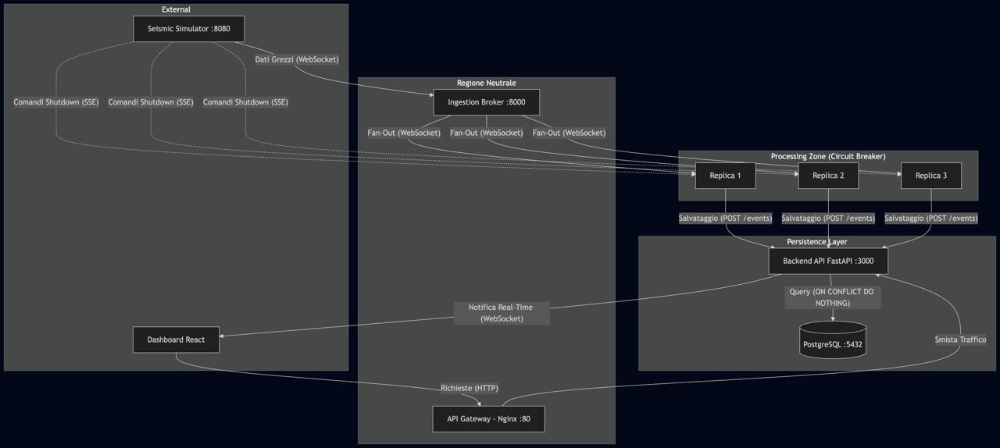

# E.C.H.O. — Earthquake & Conflict Hazard Observer

**Distributed, fault-tolerant platform for real-time seismic monitoring and automatic event classification.**

Team project for *Laboratory of Advanced Programming* — MSc in Engineering in Computer Science and Artificial Intelligence, Sapienza University of Rome (A.Y. 2025/26).

> Portfolio copy of the official team repository [enoughpaladin00/2003424_ECHO](https://github.com/enoughpaladin00/2003424_ECHO), with full commit history. See [Team](#team) for my role.

---

## What it does

A network of simulated seismic sensors streams ground-velocity measurements (20 Hz) over WebSocket. E.C.H.O. ingests those streams, analyses them in the frequency domain and classifies every anomaly in real time:

| Dominant frequency | Classification |
|---|---|
| 0.5 – 3.0 Hz | 🌍 Earthquake |
| 3.0 – 8.0 Hz | 💥 Conventional explosion |
| ≥ 8.0 Hz | ☢️ Nuclear-like event |

Each event gets a severity score, is stored exactly once in PostgreSQL and is pushed live to an analyst dashboard with an interactive map.

## Architecture



```
Seismic simulator ──WS──► Ingestion broker ──WS fan-out──► Processing replicas (×3) ──HTTP──► Persistence API ──► PostgreSQL
                           (backoff, DLQ)                   (sliding window + FFT,           (idempotent writes,
                                                              circuit breaker, SSE              retention job,
                                                              shutdown listener)                WebSocket push)
                                                                                                      │
                                              Analyst dashboard (React) ◄── Nginx API gateway ◄───────┘
                                                                            (rate limiting, WS proxy)
```

| Service | Stack | Responsibilities |
|---|---|---|
| **API gateway** | Nginx | Single entry point, per-IP rate limiting (10 r/s API, 20 r/s UI), WebSocket proxying |
| **Ingestion broker** | Python, asyncio, aiohttp, websockets | Sensor discovery, one ingestion loop per sensor, **exponential backoff** reconnection (2ⁿ s, capped at 60 s), **dead-letter queue** for malformed messages, fan-out to all live replicas |
| **Processing replicas** | Python, NumPy, FastAPI | Per-sensor **sliding window + FFT**, dominant-frequency classification, severity score, **circuit breaker** towards the DB service, SSE listener that simulates node failure, `/health` endpoint. Scaled to 3 replicas |
| **Persistence API** | FastAPI, PostgreSQL | **Idempotent** event insertion (deterministic event IDs, so replicas never create duplicates), filtered history queries, daily 30-day retention job, audit log, live WebSocket push |
| **Dashboard** | React, Leaflet | Login screen, live event feed, sensor map, filters by sensor / type / date, alerts for nuclear-like events, CSV export |

### Fault-tolerance highlights
- Replicas can be killed at any time by the simulator's shutdown stream: the broker drops dead connections without blocking the others (`gather(..., return_exceptions=True)`).
- Duplicate detections from different replicas collapse into a single row thanks to deterministic event IDs (10-second buckets).
- A circuit breaker stops replicas from hammering the database when it is unavailable.

## Run it

Prerequisites: Docker + Docker Compose, and the course-provided `seismic-signal-simulator:multiarch_v1` image loaded locally.

```bash
cd source
docker compose up --build
```

Dashboard: <http://localhost> · API: <http://localhost/api/events>

## Tests & CI

GitHub Actions ([`ci.yml`](.github/workflows/ci.yml)) validates the Compose file, builds every custom image, checks the Nginx configuration and runs the unit tests on each push/PR.

```bash
PYTHONPATH=source/processing-engine pytest source/tests -v
```

The tests cover classification for all three event types, the noise gate and the severity score.

## Documentation
- [`docs/design-document.md`](docs/design-document.md): containers, microservices, ports, persistence
- [`docs/user-stories.md`](docs/user-stories.md): the 31 user stories driving the design
- [`docs/presentation.pdf`](docs/presentation.pdf): project presentation

## Team
Fabiano Cacioli · Jacopo Rossi · Fabrizio Pietrobono · **Emanuele Smisi** · Luca Buonomini

**My role: processing & math.** I designed and built the processing service ([`source/processing-engine`](source/processing-engine/processing_replicas.py)): the per-sensor sliding window, the FFT-based dominant-frequency analysis, event classification (earthquake / explosion / nuclear-like), the severity score and the related unit tests.
